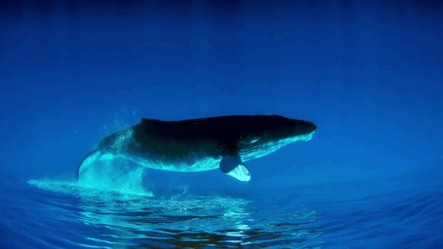

WhaleSafe4r
===========

<p align="center">

</p>
Table of Contents
-----------------

[Installation](#installation)

[Overview](#overview)

[Crawlers](#crawlers)

[Readers](#readers)

[Updaters](#updaters)

[Stats](#stats)

The WhaleSafe4r package harvests AIS data located at [this site](https://ais.sbarc.org/), which are collected and maintained by the [Santa Barbara Amateur Radio Club | K6TZ](https://www.sbarc.org/). The data is then written to a postgres database and analyzed in order to generate vessel speed report cards.

<a name="installation"/>

Installation
------------

You can install the released version of whaletrails from: [Github](https://github.com/BenioffOceanInitiative/whalesafe4r) with:

``` r
devtools::install_github("BenioffOceanInitiative/whalesafe4r")
```

<a name="overview"/>

Overview
--------

The primary areas our functions address are:

<a name="crawlers"/>

Crawlers
--------

1.  [Crawlers](https://github.com/BenioffOceanInitiative/whalesafe4r/blob/master/R/crawlers.R)

Get a list of URL's from Santa Barbara Amatuer Radio Club and use the Reader and Updater functions to get the AIS data into a relational database.

<a name="readers"/>

Readers
-------

1.  [Readers](https://github.com/BenioffOceanInitiative/whalesafe4r/blob/master/R/readers.R)

Reads a URL path into AIS data & constructs a spatial features dataframe from the AIS dataframe.

<a name="updaters"/>

Updaters
--------

1.  [Updaters](https://github.com/BenioffOceanInitiative/whalesafe4r/blob/master/R/update_ais.R)

Loops through the list of URL's from the crawlers functions to make an AIS dataframe. Then it makes a sf dataframe with each vessels track from the AIS dataframe. Finally, it intersects the sf dataframe of all vessel tracks with the VSR Zones based on space and time.

<a name="stats"/>

Stats
-----

1.  [Stats](https://github.com/BenioffOceanInitiative/whalesafe4r/blob/master/R/seg_stats.R)

Calculates Statistics for each vessel and Operator to determine cooperation grades with the Vessel Speed Reduction programs.
